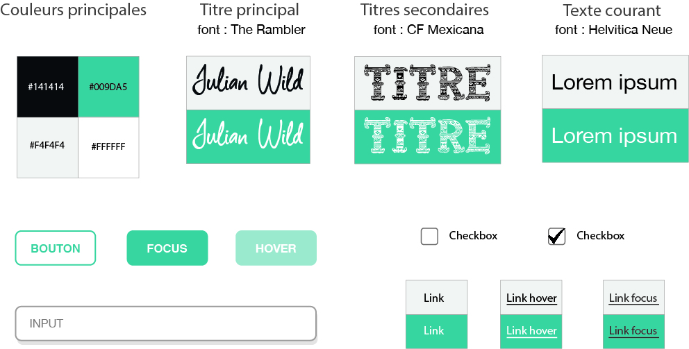
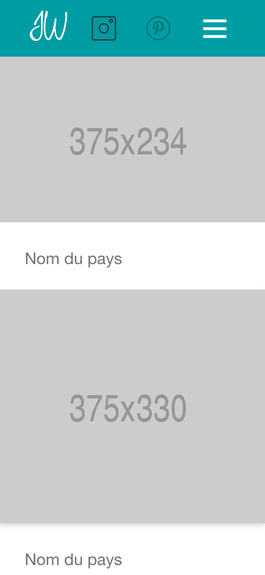
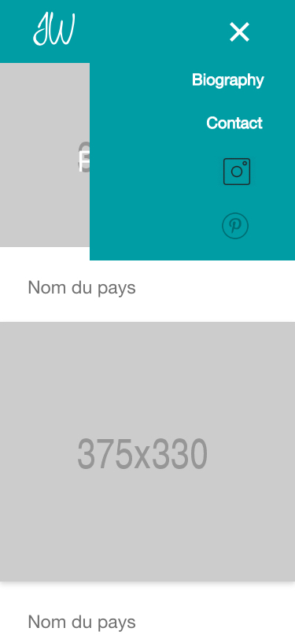
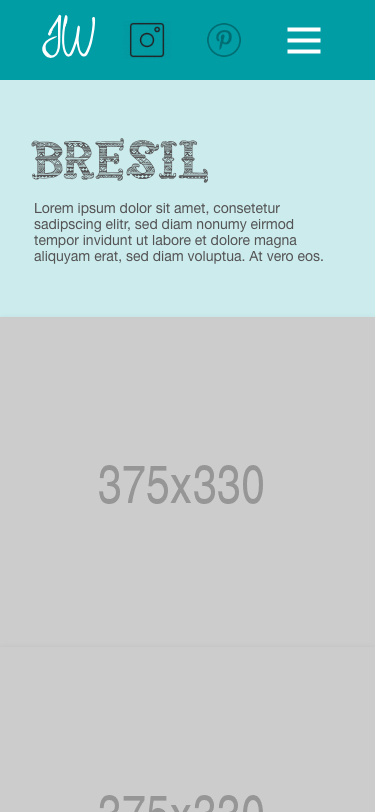
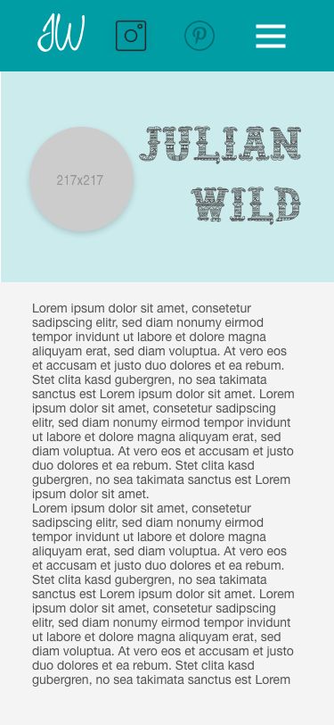
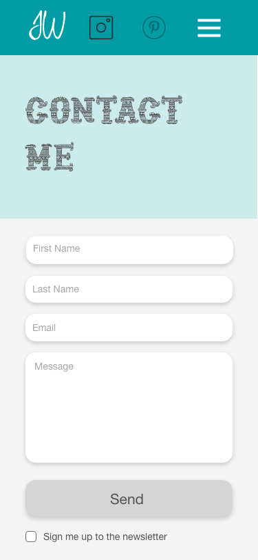
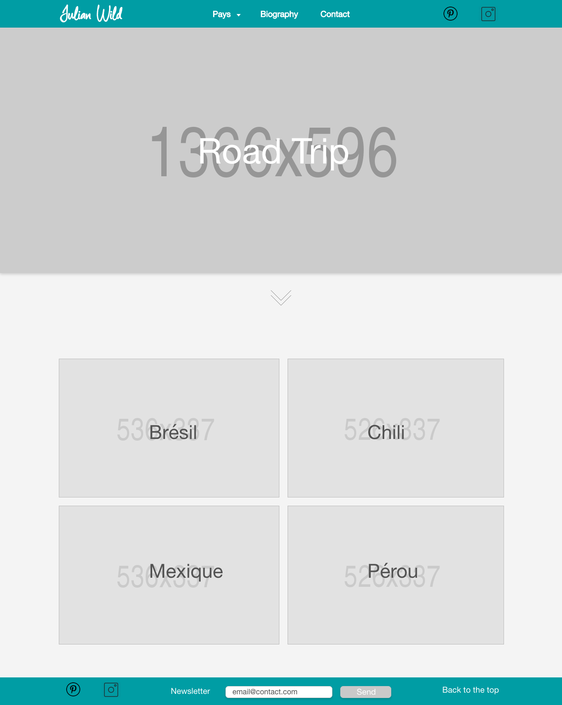
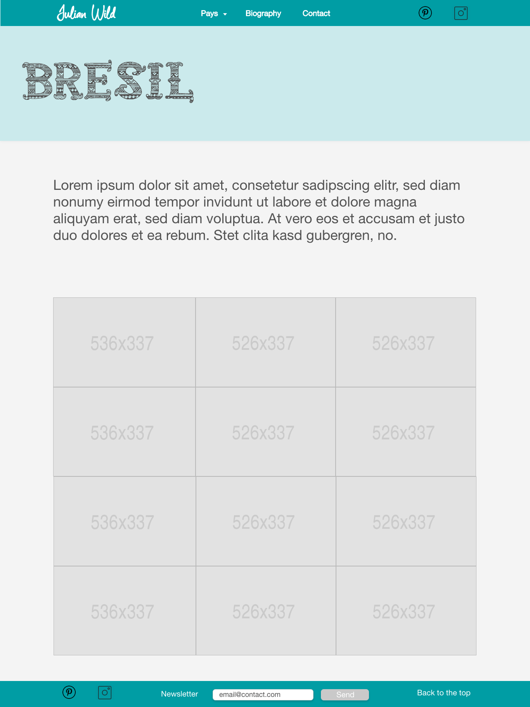
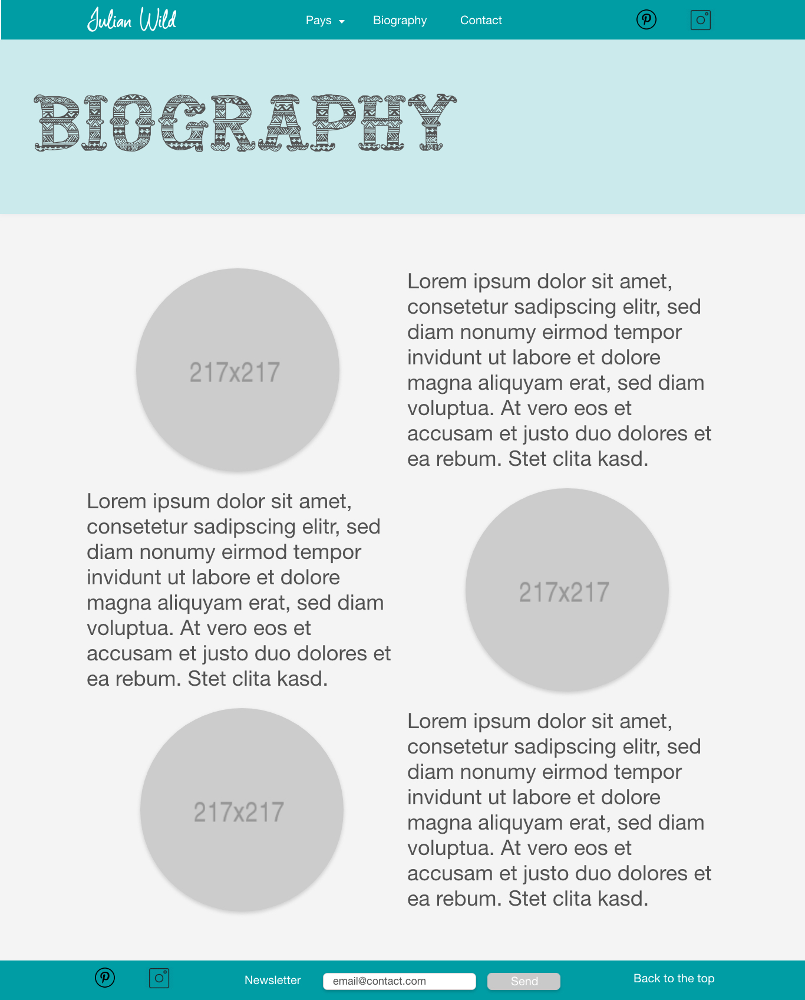
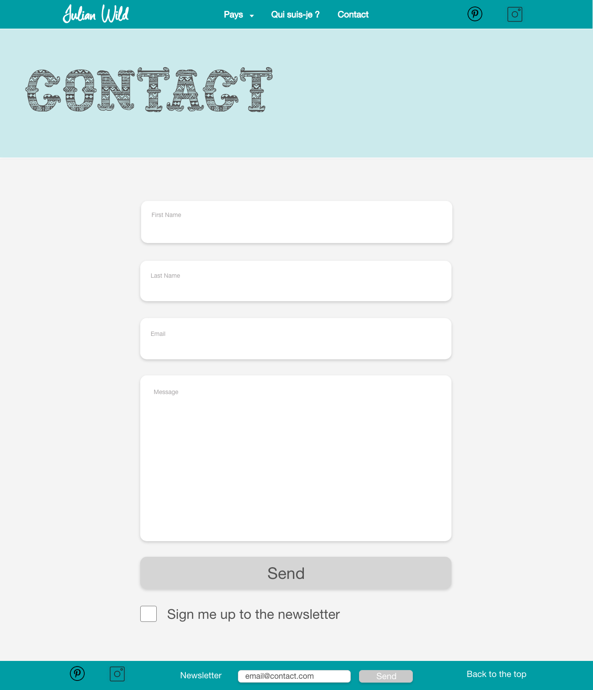

# Julian Project

##### Portfolio d'un photographe, _Julian Wild_, qui a visité l'Amérique du Sud.

## La Team

* Aurélien André | [Github](https://github.com/Krilline)
* Loukman Baism | [Github](https://github.com/Louk92)
* Emily Déat | [Github](https://github.com/EmilyDEAT)
* Lola Donval | [Github](https://github.com/Lola-D)
* Taegyun Gou | [Github](https://github.com/taegg )
* Aristide Ouedraogo | [Github](https://github.com/ariomega)
* Sten Quidelleur | [Github](https://github.com/StenQuidelleur)

## Technos

* HTML
* CSS
* Javascript

## Fonctionnalités 

* Barre de navigation
    * Titre du site
    * Menu déroulant pour trouver un pays
    * Lien vers la page Biography
    * Lien vers la page Contact
    * Lien vers les résaux sociaux
* Page d'accueil
    * Header 
    * Vignettes des différents pays
* Page du pays visité
    * Galerie de photos
    * Agrandissement des photos avec un modal
* Page biographie
    * Photos
    * Texte
* Page de contact
    * Formulaire de contact
    * Checkbox pour l'inscription à la newsletter
* Footer
    * Liens verqs les réseaux sociaux
    * Formulaire d'inscription à la newsletter
    * lien pour revenir en haut de la page

## Charte graphique

## Wireframe Mobile

## Wireframe Desktop

